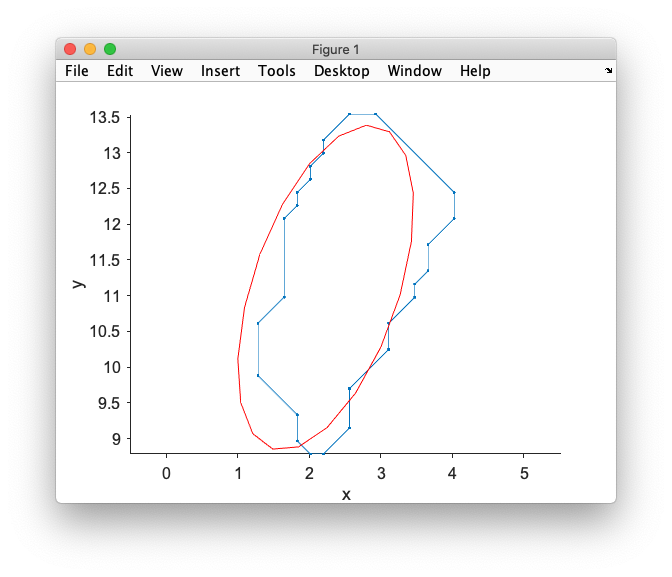
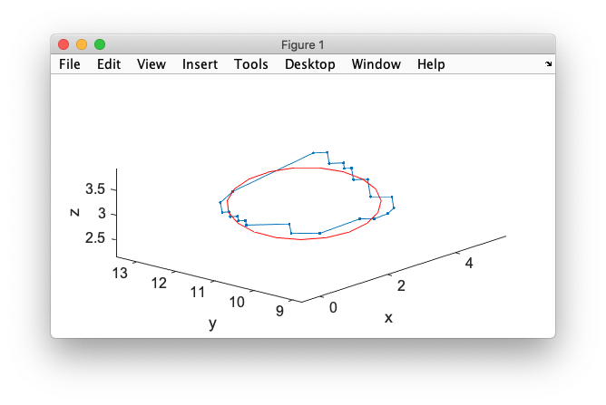
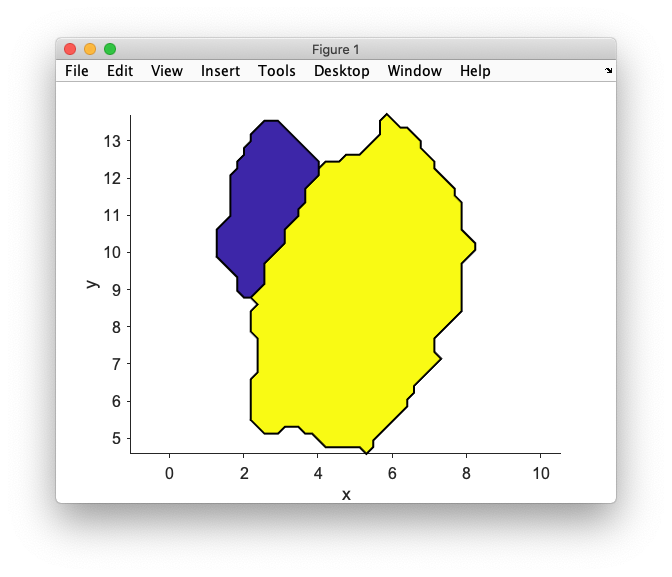
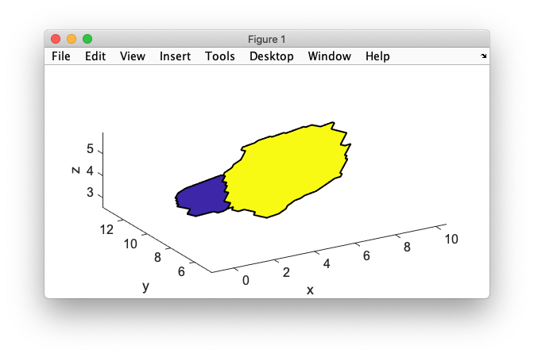
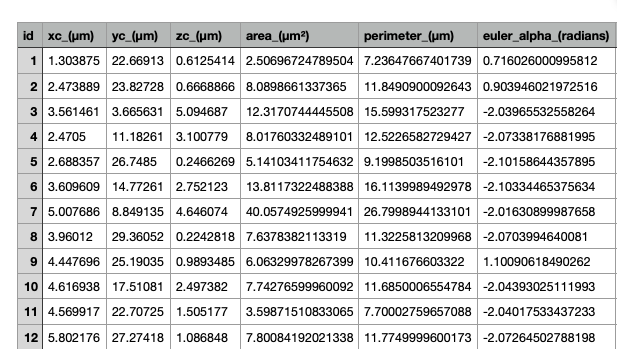
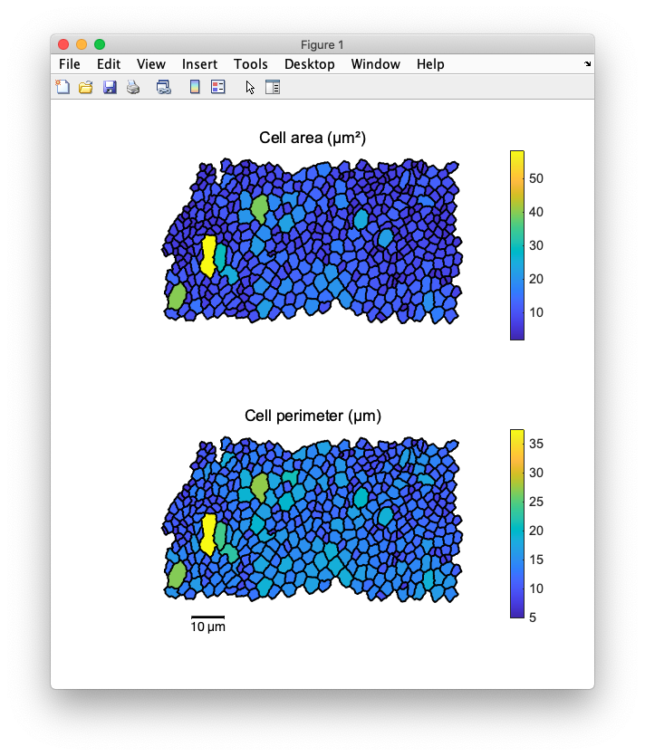
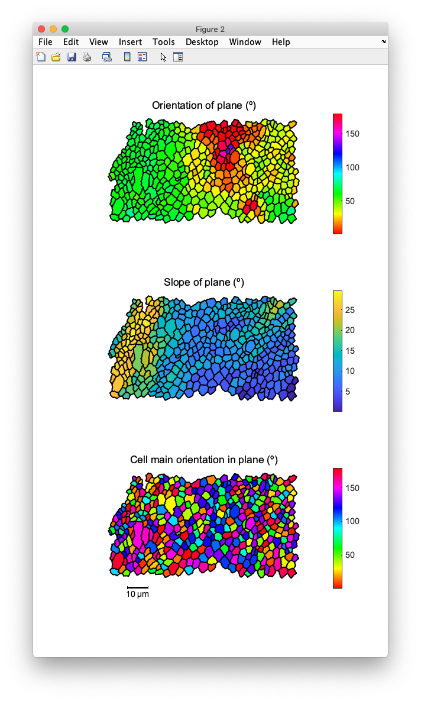

# DeProj methods.

We document here the methods of the two DeProj classes `deproj` and `epicell`. We separate methods in the ones that are useful for users of DeProj and the secondary ones that are used by other methods.

[TOC]

## The `epicell` class methods.

In the following we suppose that `o` is an instance of `epicell`, for instance obtained by executing the a [self-contained example](RunExample.m) in this repository and for instance:

```matlab
>> o = dpr.epicells(4)

o = 

  epicell with properties:

                 boundary: [26×3 single]
                   center: [2.4705 11.1826 3.1008]
             junction_ids: [5×1 double]
                     area: 8.0176
                perimeter: 12.5227
             euler_angles: [-2.0734 0.4195 -0.2500]
               curvatures: [0.0110 -4.8103e-05 0.0240 -0.0020]
              ellipse_fit: [2.2284 11.1114 3.1008 2.3848 1.1178 0.4528]
             eccentricity: 0.8834
           proj_direction: 1.2539
         uncorrected_area: 7.3173
    uncorrected_perimeter: 12.1116
                       id: 4
```

### Main `epicell` methods.

There are no important user methods for `epicell`. All the important information is already in the properties. Check the [documentation on properties](DeProjProperties.md).

### Secondary `epicell` methods.

#### `plot_contour_2d`

`h = plot_contour_2d( obj )`

Plot the cell contour (closed) projected on the XY plane, on the current axes. Return `h` the handle to the contour `Line` object.

#### `plot_ellipse_2d`

`h = plot_ellipse_2d( obj, npoints, ax )`

Plot the ellipse fitted on the contour, projected on the XY plane.

The `npoints` parameter specifies how much points to use for the contour, and `ax` the axes to plot them on. Return `h` the handle to the contour `Line` object.

```matlab
>> o.plot_contour_2d;
>> axis equal
>> hold on
>> h = o.plot_ellipse_2d( 20, gca );
>> h.Color = 'red'
>> xlabel('x'), ylabel('y')
```



#### `plot_contour_3d`

`h = plot_contour_3d( obj )`

Plot the cell contour (closed) on the tissue surface in 3D. The plot is added to the current axes. Return `h` the handle to the contour `Line` object.

#### `plot_ellipse_3d`

`h = plot_ellipse_3d( obj, npoints, ax )`

Plot the ellipse fitted on the contour, on the tissue surface in 3D.

The `npoints` parameter specifies how much points to use for the contour, and `ax` the axes to plot them on. Return `h` the handle to the contour `Line` object.

```matlab
>> o.plot_contour_3d;
>> axis equal
>> hold on
>> h = o.plot_ellipse_3d( 20, gca );
>> h.Color = 'red'
>> xlabel('x'), ylabel('y'), zlabel('z')
```



#### `get_ellipse_points`

```matlab
p = get_ellipse_points( obj, npoints )
```

Used by `plot_ellipse_2d` and `plot_ellipse_3d`.

#### `plot_patch_2d`

`h = plot_patch_2d( obj, val )`

Plot the cell contour projected on the XY plane with interior filled according to the specified value `val` and the current axes colormap.

```matlab
>> # We need a second epicell for this example.
>> o2 = dpr.epicells(7);
>> o.plot_patch_2d( 1 );
>> hold on, axis equal
>> o2.plot_patch_2d( 2 );
>> xlabel('x'), ylabel('y')
```




#### `plot_patch_3d`

`h = plot_patch_3d( obj, val )`

Plot the cell contour in 3D on the tissue surface with interior filled according to the specified value `val` and the current axes colormap.

```matlab
>> o2 = dpr.epicells(7);
>> o.plot_patch_3d( 1 );
>> hold on, axis equal
>> o2.plot_patch_3d( 2 );
>> xlabel('x'), ylabel('y'), zlabel('z')
```



#### Static method `euleurZXZ2rot`

`R = euleurZXZ2rot( E )` converts the Euler angles, given with the ZX'Z'' convention into a 3D rotation matrix. The Euler angles come for instance from the `euler_angles` field of an `epicell`.

```matlab
>> R = epicell.euleurZXZ2rot( o.euler_angles )

R =

   -0.6647    0.6563   -0.3569
   -0.7403   -0.6431    0.1962
   -0.1008    0.3946    0.9133
```

#### Static method `rot2eulerZXZ`

`[ E, E_deg ] = rot2eulerZXZ( R )` is the converse method. It returns the Euler angles (in the ZX'Z'' convention) computed from the specified rotation matrix.

```matlab
>> E = epicell.rot2eulerZXZ( R )

E =

   -2.0734    0.4195   -0.2500
```

The angles are returned in radians. The second output argument `E_deg` is the angles in degrees.

#### Static method `fit_ellipse_2d`

`[ f, Q ] = fit_ellipse_2d( p, method )`

Fit a 2D ellipse to 2D points. The points must be specified as a `N x 2` matrix of coordinates. The `method` can be `direct` (the default) or `taubin`. The `direct` method use an algorithm proposed in:

> [A. W. Fitzgibbon, M. Pilu, R. B. Fisher, "*Direct Least Squares Fitting of Ellipses*", IEEE Trans. PAMI, Vol. 21, pages 476-480 (1999).](https://ieeexplore.ieee.org/document/546029)

The `taubin` method relies on the algorithm proposed in:

> [G. Taubin, "Estimation Of Planar Curves, Surfaces And Nonplanar Space Curves Defined By Implicit Equations, With Applications To Edge And Range Image Segmentation", IEEE Trans. PAMI, Vol. 13, pages 1115-1138, (1991)](https://ieeexplore.ieee.org/document/103273)

The first output argument `f` contains the ellipse parameter in cartesian form. It is a `1 x 5` array made respectively of:

- The x coordinate of the ellipse center.
- The y coordinate of the ellipse center.
- The [semi-major axis of the ellipse](https://en.wikipedia.org/wiki/Ellipse#Semi-major_and_semi-minor_axes) `a`.
- The semi-minor axis of the ellipse `b`. We always have `a > b` and both values are positive.
- The angle of the semi-major axis with the X axis.

The second output argument `Q` contains the parametric ellipse parameter. It is a `6 x 1` array such that if its elements are A, B, C … the ellipse is given by:

*A x² + B x y + C y² + D x + E y + F = 0*

### Static method `fit_ellipse_3d`

`[ f3d, R ] = fit_ellipse_3d( p, E, method )`

Fit a 2D ellipse to a set of 3D points. The fit requires (or computes) the Euler angles of the plane fitted through the points, so that we can project them on this plane. We then make a 2D ellipse fit on the projected points. This turns to be much more robust than a 3D fit, and also closely match our configuration.

The inputs are `p` the matrix of `N x 3` points to fit, `E` the Euler angles (as `1 x 3` array) of the plane on which to project the points, and `method` the fitting method. See the documentation of `fit_ellipse_2d` for a description of the methods. If `method` is not specified, the method uses the `direct` algorithm. If the Euler angles `E` are not specified, they are computed using singular value decomposition.

The first output arguments `f3d` contains the ellipse parameter in cartesian form. It is a `1 x 6` array made respectively of:

- The x coordinate of the ellipse center.
- The y coordinate of the ellipse center.
- The z coordinate of the ellipse center.
- The [semi-major axis of the ellipse](https://en.wikipedia.org/wiki/Ellipse#Semi-major_and_semi-minor_axes) `a`.
- The semi-minor axis of the ellipse `b`. We always have `a > b` and both values are positive.
- The angle of the semi-major axis with the X'' axis, after the composed rotation by the Euler angles.

The second argument `R` is the rotation matrix computed from the Euler angles.


## The `deproj` class methods.

A `deproj` instance has several interesting methods, that let you export and display the analysis results. In particular the plotting routines: you will most likely be adapting them to your needs with a bit of MATLAB.

In the following we suppose that `dpr` is an instance of `deproj`, for instance obtained by executing the a [self-contained example](RunExample.m) in this repository:

```matlab
>> dpr

dpr = 

  deproj with properties:

          epicells: [426×1 epicell]
    junction_graph: [1×1 graph]
             units: 'µm'
```

### Main `deproj` methods.

#### `to_table`

`T = to_table( obj )`

Export masurements to a MATLAB table.

```matlab
>> T = dpr.to_table;
>> head(T)

ans =

  8×23 table

    id      xc        yc        zc        area     perimeter    euler_alpha     ...
    __    ______    ______    _______    ______    _________    ___________     ...

    1     1.3039    22.669    0.61254     2.507     7.2365        0.71603       ...
    2     2.4739    23.827    0.66689    8.0899     11.849        0.90395       ...
    3     3.5615    3.6656     5.0947    12.317     15.599        -2.0397       ...
    4     2.4705    11.183     3.1008    8.0176     12.523        -2.0734       ...
    5     2.6884    26.749    0.24663     5.141     9.1999        -2.1016       ...
    6     3.6096    14.773     2.7521    13.812     16.114        -2.1033       ...
    7     5.0077    8.8491     4.6461    40.057       26.8        -2.0163       ...
    8     3.9601    29.361    0.22428    7.6378     11.323        -2.0704       ...
```

The table also stores the physical units of each columns:

```matlab
>> T.Properties.VariableUnits

ans =

  1×23 cell array

  Columns 1 through 7

    {0×0 char}    {'µm'}    {'µm'}    {'µm'}    {'µm²'}    {'µm'}    {'radians'} ...
```

A short description of the columns is present:

```matlab
>> T.Properties.VariableDescriptions{7}

ans =

    'First Euler angle for the cell plane (rotation around Z)'
```

And a table description:

```matlab
>> T.Properties.Description

ans =

    'Data generated from DeProj software, exported on 21-Jul-2020 23:07:02.'
```

#### `to_file`

`to_file( obj, file_name, include_header )`

Exports results to a spreadsheet file. 

If `file_name` has `.csv` as extension, the data is saved as a CSV file. If it has `.xlsx` as an extension, it is saved as an Excel spreadsheet. The boolean flag `include_header` specifies whether the file will have a header with column names and units.

```matlab
dpr.to_file( 'table.csv' )
dpr.to_file( 'table.xlsx' )
```



#### `plot_sizes`

`[ hf, ax1, ax2 ] = plot_sizes( obj, scale_bar_length )`

Generate a figure with the cells area and perimeter. All the plots generated by the `plot_*` methods are 3D plots. The cells are drawn with their 3D coordinates and you can zoom, rotate, pan to make the curvature of the tissue appear. 

The `scale_bar_length` parameter specifies what should be the length (in physical units) of the scale bar added to the bottom left of the plot. By default it is 10. The output arguments `[ hf, ax1, ax2 ]` are respectfully the handles to the figure created, to the top axes and to the bottom axes. 

```matlab
>> dpr.plot_sizes
```



#### `plot_fit_plane`

`[ hf, ax1, ax2, ax3 ] = plot_fit_plane( obj, scale_bar_length )`

Generate a figure with the local plane orientation for each cell. This orientation is given as 3 Euler angles in the [ZX'Z'' convention](https://en.wikipedia.org/wiki/Euler_angles#Chained_rotations_equivalence). 

- The first one, `alpha` is the orientation of the cell plane (top panel below). As an analogy, imaging you are facing a hill, the slope going up. The direction (south, west…) in which the slope is the largest is given by the angle `alpha`. On these figures we wrap the angle between 0º and 180º to and because of MATLAB convention, this angle is measured counterclockwise from the Y axis (so 90º corresponds to a slope going up in the east-west direction).
- The second one, `beta` measures the slope of this plane with XY plane (middle panel). A value of 0º indicates that the cell plane is parallel to XY. 
- The third one , `gamma` measures the cell main orientation in the cell plane (bottom panel). Because the cell plane was rotated a first time by `alpha`, this angle does not give a result immediately usable. 

```matlab
>> dpr.plot_fit_plane
```



### Secondary `deproj` methods.