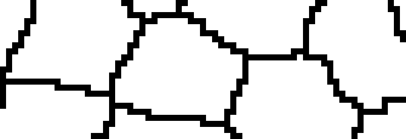

# DeProj methods.

We document here the methods of the two DeProj classes `deproj` and `epicell`. We separate methods in the ones that are useful for users of DeProj and the secondary ones that are used by other methods.

But the really important methods are those who create a `deproj` analysis results from the images. You can directly jump to the `deproj.from_heightmap` method.

[TOC]

## The `deproj` class methods.

A `deproj` instance has several interesting methods, that let you export and display the analysis results. In particular the plotting routines: you will most likely be adapting them to your needs with a bit of MATLAB.

### Main `deproj` methods.

#### Static method `from_heightmap`

This is the most important method of DeProj. It generates analysis results in the shape of a `deproj` object from a segmentation mask and a height-map image.

```matlab
obj = deproj.from_heightmap( ...
    I, ...
    H, ...
    pixel_size, ...
    voxel_depth, ...
    units, ...
    invert_z, ...    
    inpaint_zeros, ...
    prune_zeros )
```

Returns a `deproj` object built from segmentation and height-map.

You need two images as input.

The **segmentation mask image** is the results of the segmentation step, and must be a black and white image where each object is white and separated from its neighbor by a black ridge. Importantly the ridge must be connected using 8-connectivity. For instance, this is good (the ridges can be connected by the pixel diagonals):


The following is **not good** (the ridges only move east west north and south):



The **height-map** is an image of the exact same size that the segmentation image, and for which the pixel value reports the Z position of the tissue surface. For instance:


On this example the pixel value is a float number that gives the Z position from which the projection pixel was taken. 

We now explain the meaning of other parameters in an example using the images that are present in the `samples` folder of this repository. They are a small excerpt of a 3D image of a drosophila pupal notum labelled for E-cadherin, and projected with the LocalZProjector (courtesy of Léo Valon, [Romain Levayer lab](https://research.pasteur.fr/en/team/cell-death-and-epithelial-homeostasis/), Institut Pasteur). 

```matlab
% You must first load the two images.
% Path to the images.
>> root_folder = 'samples';

>> mask_filename       = 'Segmentation-2.tif';
>> I = imread( fullfile( root_folder, mask_filename ) );

>> heightmap_filename   = 'HeightMap-2.tif';
>> H = imread( fullfile( root_folder, heightmap_filename ) );

% We can directly report all the measurements in physical units. 
% To do so we need to specify what is the unit of length, 
% and what is the pixel size in X & Y:
>> pixel_size = 0.183; % µm
>> units = 'µm';
>> voxel_depth = 1.; % µm

% Finally we have some options to deal with tissue orientation and missing tissue. 
% When we have `value = 0` in a region of the height-map, this signals that the
% projection is not defined at this location, for instance if the tissue is not
% imaged in these regions. We can then extrapolate the height-map there,
% and/or remove cells that touch such a region.

% If this flag is set to true, the height-map will be extrapolated in regions 
% where its value is 0.
>> inpaint_zeros = true;

% Remove objects that have a Z position equal to 0. Normally this
% value reports objects that are out of the region-of-interest.
>> prune_zeros = true;

% Often inverted microscopes are used to image these tissues. When the 
% sample is arranged on its back, this leads the bottom of the tissue 
% surface to have large Z value (this is the case for the sample data).
% The following flag is a convenience that flips it for better display.
% Invert z for plotting.
>> invert_z = true;


% The method call itself.
>> dpr = deproj.from_heightmap( ...
    I, ...
    H, ...
    pixel_size, ...
    voxel_depth, ...
    units, ...
    invert_z, ...    
    inpaint_zeros, ...
    prune_zeros );

____
Opening mask image: Segmentation-2.tif
Opening height-map image: HeightMap-2.tif
Converting mask to objects.
Converted a 282 x 508 mask in 2.7 seconds. Found 426 objects and 1840 junctions.
Typical object scale: 10.1 pixels or 1.84 µm.
Collecting Z coordinates.
Done in 0.4 seconds.
Removed 0 junctions at Z=0.
Removed 0 objects touching these junctions.
Computing tissue local curvature.
Computing morphological descriptors of all objects.
Done in 3.3 seconds.
____

>> dpr

dpr = 

  deproj with properties:

          epicells: [426×1 epicell]
    junction_graph: [1×1 graph]
             units: 'µm'

```

In the following we suppose that `dpr` is an instance of `deproj` created by this example.

#### `to_table`

`T = to_table( obj )`

Export masurements to a MATLAB table.

```matlab
>> T = dpr.to_table;
>> head(T)

ans =

  8×23 table

    id      xc        yc        zc        area     perimeter    euler_alpha     ...
    __    ______    ______    _______    ______    _________    ___________     ...

    1     1.3039    22.669    0.61254     2.507     7.2365        0.71603       ...
    2     2.4739    23.827    0.66689    8.0899     11.849        0.90395       ...
    3     3.5615    3.6656     5.0947    12.317     15.599        -2.0397       ...
    4     2.4705    11.183     3.1008    8.0176     12.523        -2.0734       ...
    5     2.6884    26.749    0.24663     5.141     9.1999        -2.1016       ...
    6     3.6096    14.773     2.7521    13.812     16.114        -2.1033       ...
    7     5.0077    8.8491     4.6461    40.057       26.8        -2.0163       ...
    8     3.9601    29.361    0.22428    7.6378     11.323        -2.0704       ...
```

The table also stores the physical units of each columns:

```matlab
>> T.Properties.VariableUnits

ans =

  1×23 cell array

  Columns 1 through 7

    {0×0 char}    {'µm'}    {'µm'}    {'µm'}    {'µm²'}    {'µm'}    {'radians'} ...
```

A short description of the columns is present:

```matlab
>> T.Properties.VariableDescriptions{7}

ans =

    'First Euler angle for the cell plane (rotation around Z)'
```

And a table description:

```matlab
>> T.Properties.Description

ans =

    'Data generated from DeProj software, exported on 21-Jul-2020 23:07:02.'
```

#### `to_file`

`to_file( obj, file_name, include_header )`

Exports results to a spreadsheet file. 

If `file_name` has `.csv` as extension, the data is saved as a CSV file. If it has `.xlsx` as an extension, it is saved as an Excel spreadsheet. The boolean flag `include_header` specifies whether the file will have a header with column names and units.

```matlab
dpr.to_file( 'table.csv' )
dpr.to_file( 'table.xlsx' )
```


#### `plot_sizes`

`[ hf, ax1, ax2 ] = plot_sizes( obj, scale_bar_length )`

Generate a figure with the cells area and perimeter. All the plots generated by the `plot_*` methods are 3D plots. The cells are drawn with their 3D coordinates and you can zoom, rotate, pan to make the curvature of the tissue appear. 

The `scale_bar_length` parameter specifies what should be the length (in physical units) of the scale bar added to the bottom left of the plot. By default it is 10. The output arguments `[ hf, ax1, ax2 ]` are respectfully the handles to the figure created, to the top axes and to the bottom axes. 

```matlab
>> dpr.plot_sizes
```


#### `plot_fit_plane`

`[ hf, ax1, ax2, ax3 ] = plot_fit_plane( obj, scale_bar_length )`

Generate a figure with the local plane orientation for each cell. This plane is the oblique plane that is tangent, or as close as possible, to the points on the cell boundary. Its orientation is given as the **3 Euler angles** in the [ZX'Z'' convention](https://en.wikipedia.org/wiki/Euler_angles#Chained_rotations_equivalence). 

- The first one, `alpha` is the orientation of the cell plane (top panel below). As an analogy, imaging you are facing a hill, the slope going up. The direction (south, west…) in which the slope is the largest is given by the angle `alpha`. On these figures we wrap the angle between 0º and 180º to and because of MATLAB convention, this angle is measured counterclockwise from the Y axis (so 90º corresponds to a slope going up in the east-west direction).
- The second one, `beta` measures the slope of this plane with XY plane (middle panel). A value of 0º indicates that the cell plane is parallel to XY. 
- The third one , `gamma` measures the cell main orientation in the cell plane (bottom panel). Because the cell plane was rotated a first time by `alpha`, this angle does not give a result immediately usable. 

```matlab
>> dpr.plot_fit_plane
```


#### `plot_fit_ellipse`

`[ hf, he ] = plot_fit_ellipse( obj, scale_bar_length )`

Plot the 2D ellipses on the 3D tissue surface.

The ellipses are plotted in 3D, with the semi-major axis identified by a line. They are coloured by their orientation (projected on the XY plane). The output arguments are respectively `hf` the handle to the figure created and `he` the list of handles to the ellipse and lines created.

```matlab
>> dpr.plot_fit_ellipse;
```


#### `plot_curvatures`

`[ hf, ax1, ax2, ax3 ] = plot_curvatures( obj, scale_bar_length )`

Generate a figure with the local curvature for a collection of epicells. The output arguments are respectively `hf` the handle to the figure created and the 3 handles to the axes created from top to bottom.

DeProj computes the [mean curvature](https://en.wikipedia.org/wiki/Mean_curvature), the [Gaussian curvature](https://en.wikipedia.org/wiki/Gaussian_curvature) and the [principle curvatures](https://en.wikipedia.org/wiki/Principal_curvature), but this plot only includes the mean curvature and the principal curvatures (they have the same units). See the description of these properties in the [documentation on properties](DeProjProperties.md).

```matlab
>> dpr.plot_curvatures;
```


#### `plot_distorsions`

`[ hf, ax1, ax2 ] = plot_distorsions( obj, scale_bar_length )`

Generate a figure with the error on uncorrected cells area and perimeter.

#### `add_plot_id`

`hts = add_plot_id( obj, ax )`

Add the epicell ids to the specified plot axes `ax`.

```matlab
>> [ hf, ax1, ax2 ] = dpr.plot_sizes;
>> dpr.add_plot_id( ax1 );
```


### Secondary `deproj` methods.

These secondary methods are used by the methods described above. Feel free to reuse them in your post-analysis pipelines.

#### `add_plot_variable`

`hts = add_plot_variable( obj, values, ax )`

Plots the cell boundaries as patches, colored by the specified values.

This method generates the colored panels of the figures above. It takes all the cell boundaries, plot each of them as a patch, and color them according to the values in the `values` array. The 3rd input arguments `ax` is not optional and specifies the handle of the axes to draw the cells in. The output argument `hts` is the list of handles to the patch objects created.

All the `add_plot_*` methods derive from this one.

#### `add_ellipse_variable`

`hts = add_ellipse_variable( obj, values, cmap, ax )`

This method does the same thing that the one described above, but plot the cells as their corresponding 2D ellipse. The third argument required is `camp` the colormap to use for colouring. 

#### Static method `cmap_seismic`

A colormap that goes from dark red to dark blue with white in the middle, used in the local curvature figure.

#### Static method `compute_curvatures`

Routine used to compute the local curvatures.

## The `epicell` class methods.

In the following we suppose that `o` is an instance of `epicell`, for instance obtained by executing the a [self-contained example](RunExample.m) in this repository and for instance:

```matlab
>> o = dpr.epicells(4)

o = 

  epicell with properties:

                 boundary: [26×3 single]
                   center: [2.4705 11.1826 3.1008]
             junction_ids: [5×1 double]
                     area: 8.0176
                perimeter: 12.5227
             euler_angles: [-2.0734 0.4195 -0.2500]
               curvatures: [0.0110 -4.8103e-05 0.0240 -0.0020]
              ellipse_fit: [2.2284 11.1114 3.1008 2.3848 1.1178 0.4528]
             eccentricity: 0.8834
           proj_direction: 1.2539
         uncorrected_area: 7.3173
    uncorrected_perimeter: 12.1116
                       id: 4
```

### Main `epicell` methods.

There are no important user methods for `epicell`. All the important information is already in the properties. Check the [documentation on properties](DeProjProperties.md).

### Secondary `epicell` methods.

#### `plot_contour_2d`

`h = plot_contour_2d( obj )`

Plot the cell contour (closed) projected on the XY plane, on the current axes. Return `h` the handle to the contour `Line` object.

#### `plot_ellipse_2d`

`h = plot_ellipse_2d( obj, npoints, ax )`

Plot the ellipse fitted on the contour, projected on the XY plane.

The `npoints` parameter specifies how much points to use for the contour, and `ax` the axes to plot them on. Return `h` the handle to the contour `Line` object.

```matlab
>> o.plot_contour_2d;
>> axis equal
>> hold on
>> h = o.plot_ellipse_2d( 20, gca );
>> h.Color = 'red'
>> xlabel('x'), ylabel('y')
```


#### `plot_contour_3d`

`h = plot_contour_3d( obj )`

Plot the cell contour (closed) on the tissue surface in 3D. The plot is added to the current axes. Return `h` the handle to the contour `Line` object.

#### `plot_ellipse_3d`

`h = plot_ellipse_3d( obj, npoints, ax )`

Plot the ellipse fitted on the contour, on the tissue surface in 3D.

The `npoints` parameter specifies how much points to use for the contour, and `ax` the axes to plot them on. Return `h` the handle to the contour `Line` object.

```matlab
>> o.plot_contour_3d;
>> axis equal
>> hold on
>> h = o.plot_ellipse_3d( 20, gca );
>> h.Color = 'red'
>> xlabel('x'), ylabel('y'), zlabel('z')
```


#### `get_ellipse_points`

```matlab
p = get_ellipse_points( obj, npoints )
```

Used by `plot_ellipse_2d` and `plot_ellipse_3d`.

#### `plot_patch_2d`

`h = plot_patch_2d( obj, val )`

Plot the cell contour projected on the XY plane with interior filled according to the specified value `val` and the current axes colormap.

```matlab
>> # We need a second epicell for this example.
>> o2 = dpr.epicells(7);
>> o.plot_patch_2d( 1 );
>> hold on, axis equal
>> o2.plot_patch_2d( 2 );
>> xlabel('x'), ylabel('y')
```


#### `plot_patch_3d`

`h = plot_patch_3d( obj, val )`

Plot the cell contour in 3D on the tissue surface with interior filled according to the specified value `val` and the current axes colormap.

```matlab
>> o2 = dpr.epicells(7);
>> o.plot_patch_3d( 1 );
>> hold on, axis equal
>> o2.plot_patch_3d( 2 );
>> xlabel('x'), ylabel('y'), zlabel('z')
```


#### Static method `euleurZXZ2rot`

`R = euleurZXZ2rot( E )` converts the Euler angles, given with the ZX'Z'' convention into a 3D rotation matrix. The Euler angles come for instance from the `euler_angles` field of an `epicell`.

```matlab
>> R = epicell.euleurZXZ2rot( o.euler_angles )

R =

   -0.6647    0.6563   -0.3569
   -0.7403   -0.6431    0.1962
   -0.1008    0.3946    0.9133
```

#### Static method `rot2eulerZXZ`

`[ E, E_deg ] = rot2eulerZXZ( R )` is the converse method. It returns the Euler angles (in the ZX'Z'' convention) computed from the specified rotation matrix.

```matlab
>> E = epicell.rot2eulerZXZ( R )

E =

   -2.0734    0.4195   -0.2500
```

The angles are returned in radians. The second output argument `E_deg` is the angles in degrees.

#### Static method `fit_ellipse_2d`

`[ f, Q ] = fit_ellipse_2d( p, method )`

Fit a 2D ellipse to 2D points. The points must be specified as a `N x 2` matrix of coordinates. The `method` can be `direct` (the default) or `taubin`. The `direct` method use an algorithm proposed in:

> [A. W. Fitzgibbon, M. Pilu, R. B. Fisher, "*Direct Least Squares Fitting of Ellipses*", IEEE Trans. PAMI, Vol. 21, pages 476-480 (1999).](https://ieeexplore.ieee.org/document/546029)

The `taubin` method relies on the algorithm proposed in:

> [G. Taubin, "Estimation Of Planar Curves, Surfaces And Nonplanar Space Curves Defined By Implicit Equations, With Applications To Edge And Range Image Segmentation", IEEE Trans. PAMI, Vol. 13, pages 1115-1138, (1991)](https://ieeexplore.ieee.org/document/103273)

The first output argument `f` contains the ellipse parameter in cartesian form. It is a `1 x 5` array made respectively of:

- The x coordinate of the ellipse center.
- The y coordinate of the ellipse center.
- The [semi-major axis of the ellipse](https://en.wikipedia.org/wiki/Ellipse#Semi-major_and_semi-minor_axes) `a`.
- The semi-minor axis of the ellipse `b`. We always have `a > b` and both values are positive.
- The angle of the semi-major axis with the X axis.

The second output argument `Q` contains the parametric ellipse parameter. It is a `6 x 1` array such that if its elements are A, B, C … the ellipse is given by:

*A x² + B x y + C y² + D x + E y + F = 0*

#### Static method `fit_ellipse_3d`

`[ f3d, R ] = fit_ellipse_3d( p, E, method )`

Fit a 2D ellipse to a set of 3D points. The fit requires (or computes) the Euler angles of the plane fitted through the points, so that we can project them on this plane. We then make a 2D ellipse fit on the projected points. This turns to be much more robust than a 3D fit, and also closely match our configuration.

The inputs are `p` the matrix of `N x 3` points to fit, `E` the Euler angles (as `1 x 3` array) of the plane on which to project the points, and `method` the fitting method. See the documentation of `fit_ellipse_2d` for a description of the methods. If `method` is not specified, the method uses the `direct` algorithm. If the Euler angles `E` are not specified, they are computed using singular value decomposition.

The first output arguments `f3d` contains the ellipse parameter in cartesian form. It is a `1 x 6` array made respectively of:

- The x coordinate of the ellipse center.
- The y coordinate of the ellipse center.
- The z coordinate of the ellipse center.
- The [semi-major axis of the ellipse](https://en.wikipedia.org/wiki/Ellipse#Semi-major_and_semi-minor_axes) `a`.
- The semi-minor axis of the ellipse `b`. We always have `a > b` and both values are positive.
- The angle of the semi-major axis with the X'' axis, after the composed rotation by the Euler angles.

The second argument `R` is the rotation matrix computed from the Euler angles.


