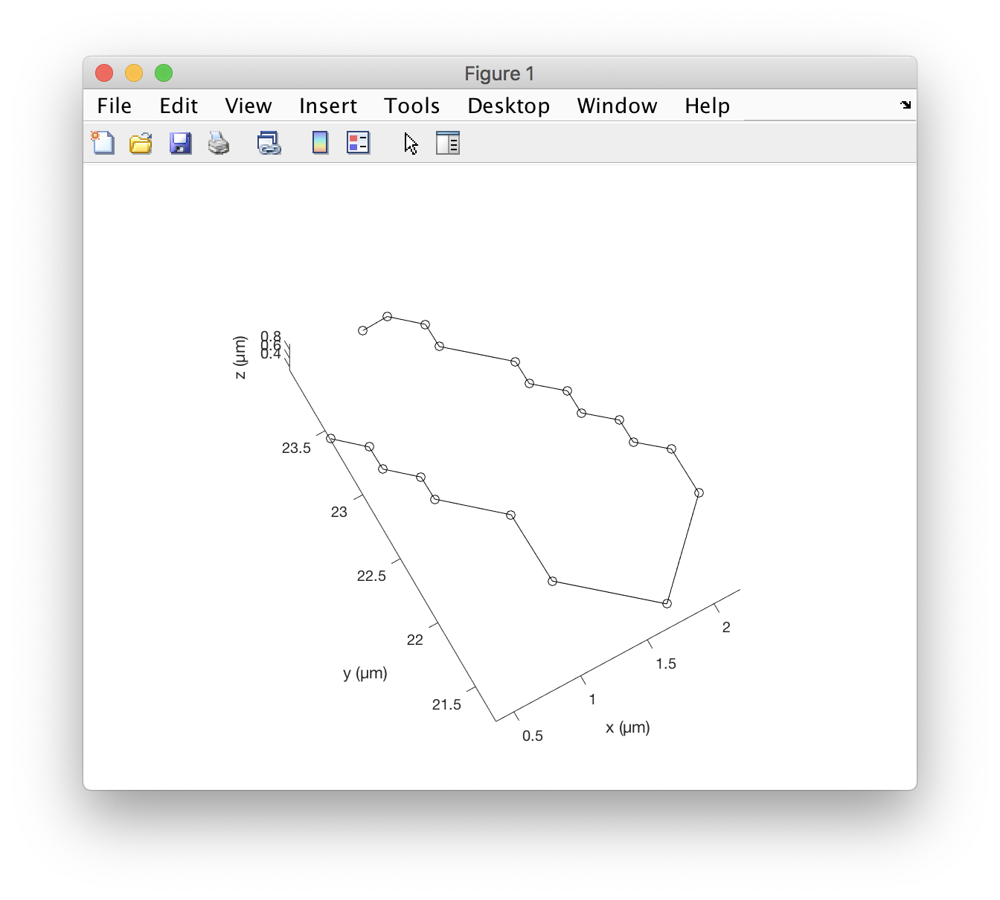
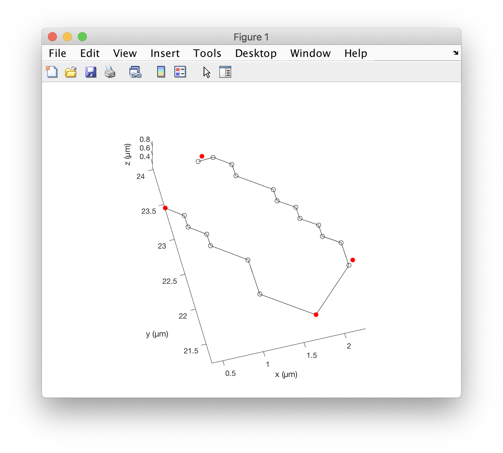

# DeProj metrics.

We give here the list of metrics returned by DeProj and their definition.

[TOC]

## The core classes: `deproj` and `epicell`.

The DeProj toolbox revolves around two MATLAB classes:

- The `epicell`class is used to store the data for one cell in a tissue. It is made of several fields we describe below:

```matlab
o = 

  epicell with properties:

                 boundary: [26×3 single]
                   center: [2.4705 11.1826 3.1008]
             junction_ids: [5×1 double]
                     area: 8.0176
                perimeter: 12.5227
             euler_angles: [-2.0734 0.4195 -0.2500]
               curvatures: [0.0110 -4.8103e-05 0.0240 -0.0020]
              ellipse_fit: [2.2284 11.1114 3.1008 2.3848 1.1178 0.4528]
             eccentricity: 0.8834
           proj_direction: 1.2539
         uncorrected_area: 7.3173
    uncorrected_perimeter: 12.1116
                       id: 4
```


- The `deproj` class manages a collection of `epicell`s, and represent for instance the results of the analysis of a whole image.

```matlab
dpr = 

  deproj with properties:

          epicells: [426×1 epicell]
    junction_graph: [1×1 graph]
             units: 'µm'
```

## The `epicell` class properties.

### `boundary`

The `boundary` property stores a 3D polygon that delimits the cell. It is represented as a `N x 3` matrix, with points sorted along the polygon. The coordinates are in physical units. The Z-values are the position of the vertices on the tissue surface, given the by the smoothed height-map. 

There are fewer than on vertex per pixel on the original segmentation image: we prune redundant points to lower the memory footprint of segmentation results.

```matlab
o = dpr.epicells(1);
p = o.boundary;
plot3( p(:,1), p(:,2), p(:,3), 'k-o' )
xlabel('x (µm)'), ylabel('y (µm)'), zlabel('z (µm)')
axis equal
```



### `center`

The cell center in physical coordinates. `1 x 3` array.

### `junction_ids`

The list of indices of junctions that this cell touches.

You can notice that a `deproj` instance has a `junction_graph` property. This is the graph of the junctions in the tissues. A junction is a location on the tissue surface where at least 3 cells connect. We give more details the next paragraph on `deproj` properties.

```matlab
dpr = 

  deproj with properties:

          epicells: [426×1 epicell]
    junction_graph: [1×1 graph]
             units: 'µm'

>> ids = o.junction_ids

ids =

     1
     5
    10
    16

>> j = dpr.junction_graph.Nodes( ids, : ) 

j =

  4×2 table

             Centroid              ID
    ___________________________    __

    0.366     23.424    0.36189     1
    0.976     24.034     0.3217     5
    1.647     21.228    0.90516    10
    2.257     21.838    0.92981    16

>> pj = j.Centroid;
>> plot3( p(:,1), p(:,2), p(:,3), 'k-o' )
>> axis equal, hold on
>> plot3( pj(:,1), pj(:,2), pj(:,3), 'ro', 'MarkerFaceColor', 'r' )
>> xlabel('x (µm)'), ylabel('y (µm)'), zlabel('z (µm)')
```



### `area`

The area of the apical surface of the cell, delimeted by its boundary. This value reports the 3D area, of the de-projected cell on the tissue surface. Units are physical units; if you used a pixel size in µm, the area will be in µm².

### `perimeter`

The perimeter of the cell boundary, in physical coordinates. Again, using the real 3D coordinates and physical units of length.

### `euler_angles`

The orientation of the cell apical surface plane. This property is not entirely trivial.

The 3D boundary of the cell define an oblique plane to which they are the closest. This local plane has a certain orientation, that we give as the Euler angles, in radians, as a `1 x 3` array. The Euler angles are reported using the [ZX'Z'' convention](https://en.wikipedia.org/wiki/Euler_angles#Chained_rotations_equivalence). Repeating what we said in the example:

- The first one, `alpha` is the orientation of the cell plane. As an analogy, imaging you are facing a hill, the slope going up. The direction (south, west…) in which the slope is the largest is given by the angle `alpha`. Values within `[-π ; π[`. 
- The second one, `beta` measures the slope of this plane with XY plane (middle panel). A value of 0º indicates that the cell plane is parallel to XY. Values within `[0 ; π[`. 
- The third one , `gamma` measures the cell main orientation in the cell plane (bottom panel). Because the cell plane was rotated a first time by `alpha`, this angle does not give a result immediately usable. 

### `curvatures`

Local curvature metrics at the cell center. 

The height-maps gives the shape of the tissue surface, so we can derive the local curvature from it. The `curvatures` property is a `1 x 4` array that gives respectively:

- The [mean curvature](https://en.wikipedia.org/wiki/Mean_curvature).
- The [Gaussian curvature](https://en.wikipedia.org/wiki/Gaussian_curvature).
- The first [principle curvature](https://en.wikipedia.org/wiki/Principal_curvature).
- The second principle curvature. 

They are in physical units. If you used a pixel size in µm, the mean curvature, the first and second principle cuvature will be in 1/µm, and the Gaussian curvature will be in 1/µm².

### `ellipse_fit`

Results of the fit of a 2D ellipse on the 3D boundary of the cell.

The cell apical plane we discribe above, and which orientation is given by the `euler_angles` property, is the plane to which the 3D points of the boundary are the closest. If we project the 3D points on this plane, we can fit an ellipse to the projected 2D plane and yield a description of the cell extend and orientation. Caution: the ellipse fit is not made on the XY plane, but on an oblique plane locally tangent to the tissue. Check the Figure 3 on the example, and rotate it, to see that the ellipses have a 3D orientation.

The `ellipse_fit` contains the result of the fit, in this tangent plane, as a `1 x 6` array, containing respectively:

- The x coordinate of the ellipse center, in physical units.
- The y coordinate of the ellipse center, in physical units.
- The z coordinate of the ellipse center, in physical units. These 3 coordinates should have values very close that of the `center` property.
- The [semi-major axis of the ellipse](https://en.wikipedia.org/wiki/Ellipse#Semi-major_and_semi-minor_axes) `a`, in physical units.
- The semi-minor axis of the ellipse `b`, in physical units. We always have `a > b` and both values are positive.
- The angle of the semi-major axis with the X'' axis in the rotated tangent plane, in radians. Because this plane was rotated twice with respect to the tissue (euler angles alpha and gamma, this value is not directly usable. See the `proj_direction` property.

### `eccentricity`

The ellipse [eccentricity](https://en.wikipedia.org/wiki/Ellipse#Eccentricity), derived from the `ellipse_fit` field. 

It measures how elongated it the cell and varies from 0 to 1. Cells with an eccentricity of 0 resemble a circle. Cells with an eccentricity close to 1 are very elongated.

### `proj_direction`

The angle of the long axis of the cell ellipse, with respect to the X axis of the tissue. In radians. See the Figure 3 of the main example.

### `uncorrected_area`

The area of the cell, *if it was projected and measured on the XY plane*.This property is included only to assess the impact of the projection distorsion artifact. In physical units.

### `uncorrected_perimeter`

The same, for the cell perimeter.

### `id`

The cell unique ID within a `deproj` instance. Strictly positive integers.

## The `deproj` class properties.


