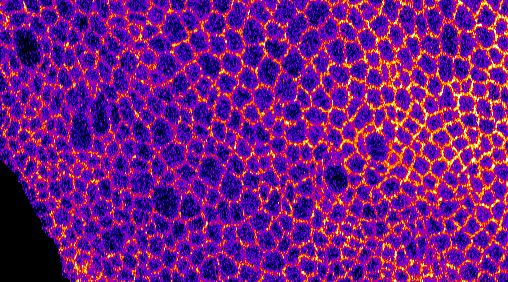
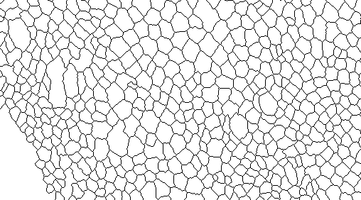

# DeProj.

DeProj is a MATLAB app made to yield accurate morphological measurements on cells in epithelia or tissues.

## Measuring cell morphologies on 2D projections.

Epithelia are a continuous layer of cells on a typically non-flat, smooth surface. A simple approach to their visualization and analysis is to perform a projection of the signal on the tissue surface on a 2D plane. When cells are labelled for their membrane (cadherin, *etc*), a projection image resembles the following:

 There are several commercial and academic open-source software tools that can segment the cell boundaries imaged on this projection, yielding for instance a black and white mask such as this one:

Several of these open-source tools offer an intuitive user interface, allowing for immediate usage and user interaction. For instance:

- [EpiTools](https://github.com/epitools) is a toolbox with MATLAB and [Icy](http://icy.bioimageanalysis.org/) components built to study the dynamics of drosophila imaginal discs. Its segmentation algorithm relies on region growing from seeds determined automatically and merged based on region areas. 
- [SEGGA](https://github.com/ZallenLab/SEGGA) is standalone applications written with MATLAB proposed for the investigation of drosophila embryo germband epithelium.
- TissueAnalyzer is a tissue segmentation tool, distributed along [TissueMiner](https://github.com/mpicbg-scicomp/tissue_miner). 

But these tools operate on 2D images and suppose that the epithelium is flat and parallel to the XY plane. When this is not the case, any **morphological measurements made on the segmentation results will be corrupted by geometrical distortions induced by the projection**. Indeed, almost all morphology metrics, such as area, circularity, polarity and orientation will be erroneous when they are measured on the 2D projection. DeProj is a MATLAB tool that takes segmentation results generated on the 2D projection and uses the height-map to correct morphology measurements made on the 2D projection. Deproj returns corrected metrics, as if they were measured from a segmentation results on the reference surface in the original 3D image.

## How-to use DeProj.

DeProj requires two inputs: 

- the reference surface for the projected tissue, 
- and a black-and-white cell-contour image resulting from a segmentation algorithm that ran on the projection. 

From them, it computes accurate metrics on the morphology of cells, as if they were measured on the not on the 2D projection, but on the curved tissue itself. A simple GUI allows entering the two inputs. The reference surface can be entered either as the height-map generated by LocalZProjector (or another tool), or as a 3D mesh to accommodate a wide range of outputs from preprocessing tools. When the first input is in the shape of a height-map, it is converted to a 3D mesh for the reference surface. The cell-contour image is internally converted to a collection of individual cell polygons. The tool then maps each node of a cell polygon onto the reference surface 3D mesh, effectively "Deprojecting" the cell contour on the tissue surface. Some morphological metrics (area, perimeter, sphericity, ... ) are then computed and saved, along with the cell contour mapped on the tissue surface. Deproj also displays several visualisation of the corrected biological object.

## Requirements.

We use builtin functions introduced in MATLAB R2019b. 
So you need at least this version.

## Launch the program
The method can both be called in a GUI and by the command line of MATLAB
1. To call the method using the GUI:

 start the DeProj_GUI app in MATLAB `>> DeProj_GUI`. The GUI will guide you to provide the proper inputs and outputs to the method as well as the method parameters. The app has been created under MATLAB R2017b version and using an older version may create unexpected behavior.

2. To call the method using the command line: enter `>> surface3D_combine()`

 * In case all arguments are provided, the method will continue with the desired inputs
 * In case no arguments are provided, the method will revert to default parameters and only ask the user for inputs and output paths.
