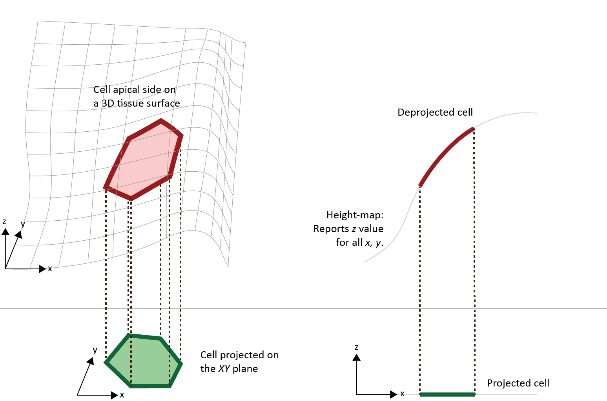
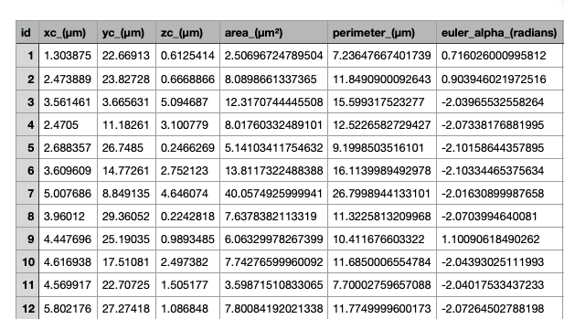

# DeProj.

DeProj is a MATLAB app made to yield accurate morphological measurements on cells in epithelia or tissues.

**Table of Contents**

   * [DeProj.](#deproj)
      * [What is DeProj useful for.](#what-is-deproj-useful-for)
         * [Measuring cell morphologies on 2D projections.](#measuring-cell-morphologies-on-2d-projections)
         * [Projection artefacts.](#projection-artefacts)
      * [How to use DeProj.](#how-to-use-deproj)
         * [Requirements.](#requirements)
         * [Installation.](#installation)
         * [Running the example.](#running-the-example)
      * [Running DeProj from MATLAB prompt.](#running-deproj-from-matlab-prompt)
         * [From a segmentation mask and a height-map.](#from-a-segmentation-mask-and-a-height-map)
            * [The segmentation mask.](#the-segmentation-mask)
            * [The height-map.](#the-height-map)
            * [Running the analysis.](#running-the-analysis)
      * [More documentation.](#more-documentation)
      * [Appendix.](#appendix)
         * [Projection tools that yields the height-map.](#projection-tools-that-yields-the-height-map)
         * [Segmentation tools for the projection.](#segmentation-tools-for-the-projection)

## What is DeProj useful for.

### Measuring cell morphologies on 2D projections.

Epithelia are a continuous layer of cells on a typically non-flat, smooth surface. A simple approach to their visualization and analysis is to perform a projection of the signal on the tissue surface on a 2D plane (think of MIP). An epithelium with cells labeled for E-cadherin resembles this (top panel, figure below):


There are several commercial and academic open-source software tools that can segment the cell boundaries imaged on this projection, yielding for instance the black and white mask in the middle panel above. (We list some of them in the last section.)

Finally, the segmentation is used to make morphological measurements (area, elongation, orientation…). For instance the bottom panel above reports the cell apical area. The color encodes the cell area from 2 µm² (blue) to 60 µm² (yellow).

### Projection artefacts.

Most of the time, the morphological measurements are made directly on the 2D segmentation. This is fine as long as the tissue is mostly parallel to the XY plane, on which its 3D volume was projected. 

When this is not the case, any **morphological measurements made on the segmentation results will be corrupted by geometrical distortions induced by the projection**. Indeed, almost all morphology metrics, such as area, circularity, polarity and orientation will be erroneous when they are measured on the 2D projection. This is illustrated on the figure below:



On this illustration, a cell (in red, top-left quadrant) is located on a region of the tissue that makes a large angle with the XY plane. Its projection on the XY plane (in green, bottom-left quadrant) therefore underestimates its size, and alters its orientation. This is recapitulated on the top-right and bottom-right quadrants, with a side view.

**DeProj** is a tool made to correct for this distorsion. It takes 1) the results of the segmentation on the projection - the green contour on the bottom-right quadrant above - 2) the height-map that follows the shape of the tissue - the gray smooth line on the top-right quadrant above - and "de-project" the cell back on its original position in the tissue - in red, top-right quadrant. Then it yields corrected morphological measurements.

## How to use DeProj.

DeProj requires two inputs: 

- the reference surface for the projected tissue, 
- and a black-and-white cell-contour image resulting from a segmentation algorithm that ran on the projection. 

From them, it computes accurate metrics on the morphology of cells, as if they were measured on the not on the 2D projection, but on the curved tissue itself. A simple GUI allows entering the two inputs. The reference surface can be entered either as the height-map generated by [LocalZProjector](https://gitlab.pasteur.fr/iah-public/localzprojector) (or another tool), or as a 3D mesh to accommodate a wide range of outputs from preprocessing tools.

The cell-contour image is internally converted to a collection of individual polygons. The tool then maps each node of a cell polygon onto the reference surface, effectively "deprojecting" the cell contour on the tissue surface. Several morphological metrics (area, perimeter, sphericity... ) are then computed and saved, along with the cell contour mapped on the tissue surface. DeProj also has utilities and tools to display and export analysis results.

### Requirements.

We use builtin functions introduced in MATLAB R2019b. So you need at least this version.

### Installation.

The simplest way to get DeProj is to use `git` to clone this repository directly.

```sh
git clone git@github.com:sebherbert/Deproj.git
```

If you do not have `git` on your system, or don't want to use it, download [the zip of the repository](https://github.com/sebherbert/Deproj/archive/rework-pub.zip).

Then you want to add DeProj to your MATLAB path. To do so, simply add the `src` folder to the MATLAB path, but do not add its subfolders. It contains only two MATLAB classes: `@epicell` (that stores the data for a single deprojected cell) and `@deproj` that is used to create and manage a collection of `@epicell`s. 

[This page](https://mathworks.com/help/matlab/ref/pathtool.html) explains how to add a folder to the MATLAB path. 

Again, it's important that you add the `src` folder to the path, but not its subfolders because they contain the DeProj classes methods. Details about MATLAB classes and path can be found [here](https://fr.mathworks.com/help/matlab/matlab_oop/organizing-classes-in-folders.html). 

To verify that this worked, just type:

```matlab
>> epicell
```

in the MATLAB prompt. You should see the following:

```matlab
ans = 

  epicell with properties:

                 boundary: []
                   center: []
             junction_ids: []
                     area: []
                perimeter: []
             euler_angles: []
               curvatures: []
              ellipse_fit: []
             eccentricity: []
           proj_direction: []
         uncorrected_area: []
    uncorrected_perimeter: []
                       id: []
```

### Running the example.

The root folder of the DeProj repository has a [self-contained example](RunExample.m), that you can run with:

```matlab
>> RunExample
```

It will used small crop of images stored in the `samples` folder. After some time you should see the following:

```
Opening mask image: Segmentation-2.tif
Opening height-map image: HeightMap-2.tif
Converting mask to objects.
Converted a 282 x 508 mask in 1.3 seconds. Found 426 objects and 1840 junctions.
Typical object scale: 10.1 pixels or 1.84 µm.
Collecting Z coordinates.
Done in 0.1 seconds.
Removed 0 junctions at Z=0.
Removed 0 objects touching these junctions.
Computing tissue local curvature.
Computing morphological descriptors of all objects.
Done in 3.5 seconds.
```

and several figures resulting from the analysis:


The plots are 3D plots of cells on the initial tissue surface. In this example, the maximal slope is modest (<20º) so the side views appear rather flat.


DeProj computes the orientation of the local plane parallel to the cell apical surface. This the plane closest to the 3D points of the cell contour. Its orientation is reported as the 3 Euler angles, following the [ZX'Z'' convention](https://en.wikipedia.org/wiki/Euler_angles#Chained_rotations_equivalence). These 3 angles are displayed in the Figure 2 below.

- The first one, `alpha` is the orientation of the cell plane (top panel below). As an analogy, imaging you are facing a hill, the slope going up. The direction (south, west…) in which the slope is the largest is given by the angle `alpha`. On these figures we wrap the angle between 0º and 180º to and because of MATLAB convention, this angle is measured counterclockwise from the Y axis (so 90º corresponds to a slope going up in the east-west direction).
- The second one, `beta` measures the slope of this plane with XY plane (middle panel). A value of 0º indicates that the cell plane is parallel to XY. 
- The third one , `gamma` measures the cell main orientation in the cell plane (bottom panel). Because the cell plane was rotated a first time by `alpha`, this angle does not give a result immediately usable. 


We project the cell contour on this inclined plane, and we fit the projected contour by a 2D ellipse. The ellipses are not parallel to the XY plane (they are in the cell plane) and they allow the computation of the cell main orientation (Figure 3 below) and its eccentricity or elongation.


Because we have access the Z-position of each location thanks to the height-map, we cam compute the [local curvature](https://en.wikipedia.org/wiki/Curvature#Curves_on_surfaces) of the tissue just at a cell position. This measure a form of 'stretch' on the cell. DeProj reports the Gaussian curvature, the mean curvature and the principal curvatures (Figure 4 below).


We can also measure the cell size (area and perimeter) on the XY projection, and compare the values to the real, deprojected area and perimeter. This gives an idea of the error caused b the projection distorsion. As expected, the error caused by the projection distorsion (Figure 5 below) is larger in areas where the local angle with the XY plane is the largest (middle panel in Figure 2 above). Again, on this example tissue, the slope is rather small so we have only a small error.


## Running DeProj from MATLAB prompt.

DeProj is mainly made of two classes, and running it from the MATLAB prompt should be convenient enough.

### From a segmentation mask and a height-map.

You need two images as input.

#### The segmentation mask. 

It is the results of the segmentation step, and must be a black and white image where each object is white and separated from its neighbor by a black ridge. Importantly the ridge must be connected using 8-connectivity. 

For instance, this is good (the ridges can be connected by the pixel diagonals):


The following is <u>not good</u> (the ridges only move east west north and south):


#### The height-map.

The height-map is an image <u>of the exact same size that the segmentation image</u>, and for which the pixel value reports the Z position of the tissue surface. For instance:


On this example the pixel value is an integer that gives the Z-plane from which the projection pixel was taken. Several academic softwares generate this height-map (under varying names) on top of the projection. We list some of them at the end of this documentation.

#### Running the analysis.

For this example, we use the images that are present in the `samples` folder of this repository. They are a small excerpt of a 3D image of a drosophila pupal notum labelled for E-cadherin, and projected with the LocalZProjector (courtesy of Léo Valon, [Romain Levayer lab](https://research.pasteur.fr/en/team/cell-death-and-epithelial-homeostasis/), Institut Pasteur). 

You must first load the two images:

```matlab
% Path to the images.
root_folder = 'samples';

mask_filename       = 'Segmentation-2.tif';
I = imread( fullfile( root_folder, mask_filename ) );

heightmap_filename   = 'HeightMap-2.tif';
H = imread( fullfile( root_folder, heightmap_filename ) );
```

We can directly report all the measurements in physical units. To do so we need to specify what is the unit of length, and what is the pixel size in X & Y:

```matlab
pixel_size = 0.183; % µm
units = 'µm';
```

The height-map of this dataset reports the *Z plane* of interest in the original 3D image. But we need to know the position in physical units, so we need to specify the pixel size in Z, or the voxel-depth:

```matlab
voxel_depth = 1.; % µm
```

If  your height-map already report the Z position and not the Z-plane, simply enter a value of `1` here.

Finally we have some options to deal with tissue orientation and missing tissue. When we have `value = 0` in a region of the height-map, this signals that the projection is not defined at this location, for instance if the tissue is not imaged in these regions. We can then extrapolate the height-map there, and/or remove cells that touch such a region.

```matlab
% If this flag is set to true, the height-map will be extrapolated in regions where its value is 0.
inpaint_zeros = true;
% Remove objects that have a Z position equal to 0. Normally this
% value reports objects that are out of the region-of-interest.
prune_zeros = true;
```

Often inverted microscopes are used to image these tissues. When the sample is arranged on its back, this leads the bottom of the tissue surface to have large Z value (this is the case for the sample data). The following flag is a convenience that flips it for better display.

```matlab
% Invert z for plotting.
invert_z = true;
```

Finally, we can run DeProj. Everything is done with a single call to:

```matlab
dpr = deproj.from_heightmap( ...
    I, ...
    H, ...
    pixel_size, ...
    voxel_depth, ...
    units, ...
    invert_z, ...    
    inpaint_zeros, ...
    prune_zeros );
```

It can take some time, depending on the size of the images. You should see something like this in the MATLAB console:

```
Opening mask image: Segmentation-2.tif
Opening height-map image: HeightMap-2.tif
Converting mask to objects.
Converted a 282 x 508 mask in 1.2 seconds. Found 426 objects and 1840 junctions.
Typical object scale: 10.1 pixels or 1.84 µm.
Collecting Z coordinates.
Done in 0.1 seconds.
Removed 0 junctions at Z=0.
Removed 0 objects touching these junctions.
Computing tissue local curvature.
Computing morphological descriptors of all objects.
Done in 3.4 seconds.
```

What you get out this process is a `deproj` object:

```matlab
>> dpr

dpr = 

  deproj with properties:

          epicells: [426×1 epicell]
    junction_graph: [1×1 graph]
             units: 'µm'
```

It manages mainly a collection of `epicell` objects, that store the data for one cell:

```matlab
>> o = dpr.epicells(4)

o = 

  epicell with properties:

                 boundary: [26×3 single]
                   center: [2.4705 11.1826 3.1008]
             junction_ids: [5×1 double]
                     area: 8.0176
                perimeter: 12.5227
             euler_angles: [-2.0734 0.4195 -0.2500]
               curvatures: [0.0110 -4.8103e-05 0.0240 -0.0020]
              ellipse_fit: [2.2284 11.1114 3.1008 2.3848 1.1178 0.4528]
             eccentricity: 0.8834
           proj_direction: 1.2539
         uncorrected_area: 7.3173
    uncorrected_perimeter: 12.1116
                       id: 4
```

We give the definition and details about these properties later in this document.

The `deproj` object can be exported to a MATLAB table:

```matlab
>> T = dpr.to_table;
>> head(T)

ans =

  8×23 table

    id      xc        yc        zc        area     perimeter    euler_alpha    ....
    __    ______    ______    _______    ______    _________    ___________    ....

    1     1.3039    22.669    0.61254     2.507     7.2365        0.71603      ....  
    2     2.4739    23.827    0.66689    8.0899     11.849        0.90395      ....  
    3     3.5615    3.6656     5.0947    12.317     15.599        -2.0397      .... 
    4     2.4705    11.183     3.1008    8.0176     12.523        -2.0734      .... 
    5     2.6884    26.749    0.24663     5.141     9.1999        -2.1016      .... 
    6     3.6096    14.773     2.7521    13.812     16.114        -2.1033      .... 
    7     5.0077    8.8491     4.6461    40.057       26.8        -2.0163      .... 
    8     3.9601    29.361    0.22428    7.6378     11.323        -2.0704      .... 
```

then saved to a `csv` or Excel file:

```matlab
dpr.to_file( 'table.csv' )
dpr.to_file( 'table.xlsx' )
```



It can also be used to generate customisable plots. Several convenience methods are there:

```matlab
>> dpr.plot_sizes
```


## More documentation.

The file [DeProjProperties.md](DeProjProperties.md) documents the properties you can find in the analysis results.

The file [DeProjMethods.md](DeProjMethods.md) documents the methods you can run with the objects returned by the analysis.

## Appendix.

### Projection tools that yields the height-map.

DeProj requires the height-map along with the segmentation of the projection, in order t "deproject" the cells onto the actual tissue surface. Here are some of the open-source projection tool that can return this output:

-  [LocalZProjector](https://gitlab.pasteur.fr/iah-public/localzprojector). DeProj is the component part of the DProj toolbox, and LocalZProjector is the first one. It can generate a hight-map that can directly be used by DeProj.
- [StackFocuser](https://imagej.nih.gov/ij/plugins/stack-focuser.html), an ImageJ plugin.
- [PreMosa](https://academic.oup.com/bioinformatics/article/33/16/2563/3104469), a standalone C++ software.
- The [Extended-Depth-Of-Field](http://bigwww.epfl.ch/demo/edf/) ImageJ plugin. 
- The [Min Cost Z Surface](https://imagej.net/Minimum_Cost_Z_surface_Projection) ImageJ plugin.
- The [Smooth Manifold Extraction](https://github.com/biocompibens/SME) MATLAB tool (a Fiji version is also distributed) and its recent, faster implementation: [FastSME](https://github.com/Shihav/FastSME).

### Segmentation tools for the projection.

Several open-source tools can segment the projection and yield the cells contour or the mask displayed above. Some of them offer an intuitive user interface, allowing for immediate usage and user interaction. For instance:

- [EpiTools](https://github.com/epitools) is a toolbox with MATLAB and [Icy](http://icy.bioimageanalysis.org/) components built to study the dynamics of drosophila imaginal discs. Its segmentation algorithm relies on region growing from seeds determined automatically and merged based on region areas. 
- [SEGGA](https://github.com/ZallenLab/SEGGA) is standalone applications written with MATLAB proposed for the investigation of drosophila embryo germband epithelium.
- TissueAnalyzer is a tissue segmentation tool, distributed along [TissueMiner](https://github.com/mpicbg-scicomp/tissue_miner). 
